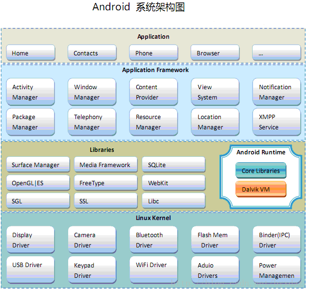
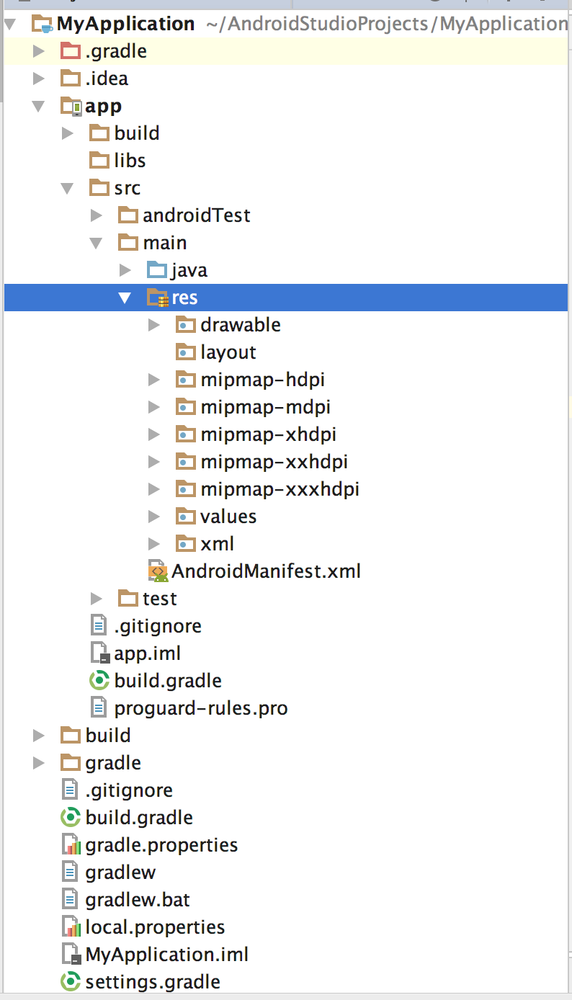
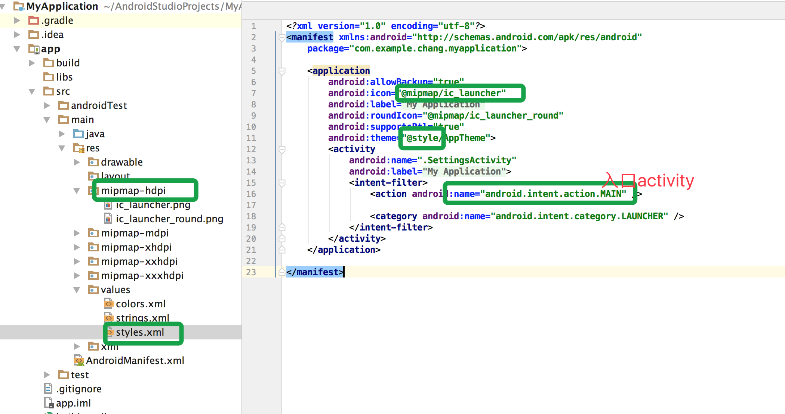
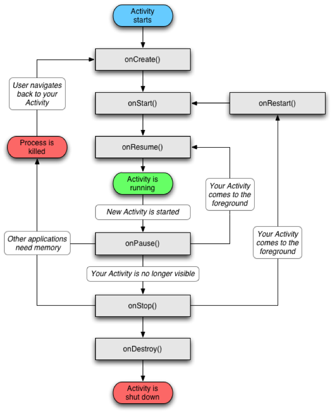

# 安卓开发入门
常艳芳<br><br>
商户前端技术组

---
## 安装软件


|软件|下载地址|说明
|:--|:--|:--|
|JDK|[http://www.oracle.com/technetwork/java/index.html](http://www.oracle.com/technetwork/java/index.html)|Java Development Kit
|SDK|[https://developer.android.com/sdk/index.html](https://developer.android.com/sdk/index.html)|安卓软件开发工具包
|Android Studio|[https://developer.android.com/studio/index.html](https://developer.android.com/studio/index.html)|IDE
|Gradle|[https://gradle.org/](https://gradle.org/)|构建工具

---

## 配置环境

- 打开.bash_profile 文件,`open ~/.bash_profile`
- 没有就新建一个,`touch ~/.bash_profile `
- 加入配置
- 保存文件,在~/.目录下执行 `source .bash_profile` 使配置生效

```javascript
	export PATH="$HOME/bin:$PATH"
	export JAVA_HOME="/Library/Java/JavaVirtualMachines/jdk1.7.0_75.jdk/Contents/Home"
	
	export ANDROID_HOME=/Users/chang/Library/Android/sdk
	export PATH=${PATH}:${ANDROID_HOME}/tools
	export PATH=${PATH}:${ANDROID_HOME}/platform-tools
	
	
	export GRADLE_HOME=/Users/chang/source/gradle
	export PATH=$PATH:$GRADLE_HOME/bin
```
--- 

## 模拟器

- Android Stuido中的AVD Manager创建模拟器
- 安装Genymontion模拟器

   1. 下载VirtualBOX（虚拟环境），https://www.virtualbox.org/ 自行安装。
   2. 下载Genymotion（飞快的android模拟器），https://www.genymotion.com/ 自行安装。
   3. 新建模拟器（需要注册一个账户），官网注册：https://www.genymotion.com/#!/auth/account-created      
   4.  android studio中绑定 Genymotion。安装Genymotion插件，重启 android studio。

注意：如果出现了 VirtualBox 无法启动虚拟设备的错误，那可能是虚拟设备 分配的内存太大了，将内存减小就可以了。
   
---

## 安卓基本框架

- 应用层
- 应用程序框架层
- 系统运行库
- Linux内核层

---



---

## 项目结构



---

### res文件

在该文件夹下的所有文件里的内容都会预编译

|目录|说明|
|:--|:--|
|res/drawable|用于放图片资源,不同dpi的.png、.jpg文件,Android会主动将这个目录下的文件进行压缩优化
|res/mipmap-*/|用于放系统icon资源|
|res/layout/|主要存放XML格式的布局文件|
|res/values/|存放各种数值资源的目录，包括颜色、string和各种样式.如<br>array.xml 定义数组<br/>colors.xml 定义一些颜色值<br/>dimens.xml定义一些尺寸值<br/>strings.xml定义字符串。<br/>styles.xml 定义样式|
|build.gradle|编译参数、代码库地址定义和依赖包的引用|

---

### AndroidManifest.xml

向Android系统注册些组件,Activity,Service,BroadcastReceiver,ContentProvider这些如果有用到，比如在这个文件注册。

---

### AndroidManifest.xml



---
## 安卓四大组件

- Activity
- Service
- Content Provider
- Broadcast Receiver

---

### Activity

- 一个Activity通常就是一个单独的屏幕（窗口）
- Activity之间通过Intent进行通信
- android应用中每一个Activity都必须要在AndroidManifest.xml配置文件中声明，否则系统将不识别也不执行该Activity

```java
public class MainActivity extends Activity implements View.OnClickListener {

    @Override
    protected void onCreate(Bundle savedInstanceState) {
        super.onCreate(savedInstanceState);
        setContentView(R.layout.main);
        findViewById(R.id.button).setOnClickListener(this);
    }
    
    @Override
    public void onClick(View v) {
     	  Log.e("Click Id","id=" + v.getId());
     	 // 在Android中Activity，Service，Broadcast receiver都是通过Intent来启动的
        //启动Service: Intent intent = new Intent(this, MyService.class); startService(intent);
        //启动Broadcast: Intent intent = new Intent(“action”); sendBroadcast(intent);
        Intent intent = new Intent(this, NewActivity.class);
        startActivity(intent);
    } 
}
```
---

### Service

- 一个一种可以在后台执行长时间运行操作而没有用户界面的应用组件.
- Activity 会使用 Context.startService() 来启动一个 Service，用 Context.stopService() 停止一个 Service。
- 用于处理一些不干扰用户使用的后台操作，可以理解成在后台运行的Activity
- Service可以处理网络事务、播放音乐，执行文件 I/O 或与内容提供程序交互

---

### Content Provider

Android中对数据操作方法有以下几种：

- file, sqlite3, Preferences  只能操作本应用内数据
- ContectResolver与ContentProvider 操作别的应用程序的数据

---

### Content Provider

- 用于保存和获取数据，使其对所有应用程序可见，实现数据共享。这是不同应用程序间共享数据的唯一方式。例如，通讯录数据被多个应用程序使用，且必须存储在一个内容提供者中。
- ContentProvider使用URI来唯一标识其数据集，这里的URI以content://作为前缀，表示该数据由ContentProvider来管理。
- 使用ContentProvider来提供内容给别的应用来操作，通过ContentResolver来操作别的应用数据
- 开发人员不会直接使用ContentProvider类的对象，大多数是通过ContentResolver对象实现对ContentProvider的操作。

---
### Broadcast Receiver

- 发送广播： 构建Intent对象，可调用sendBroadcast(Intent)方法将广播发出
- 接收广播：通过定义一个继承BroadcastReceiver类来实现，继承该类后覆盖其onReceiver方法，并在该方法中响应事件。

--- 
## Android生命周期 



--- 

```java
public class MainActivity extends Activity{

    @Override
    protected void onCreate(Bundle savedInstanceState) {
        super.onCreate(savedInstanceState);
        setContentView(R.layout.main);
    }
    
    @Override
    protected void onStart() {
        super.onStart();
    }

    @Override
    protected void onResume() {
        super.onResume();
    }

    @Override
    protected void onPause() {
        super.onPause();
    }

    @Override
    protected void onStop() {
        super.onStop();
    }

    @Override
    protected void onDestroy() {
        super.onDestroy();
    }
}
```

---

## Android用户界面

常用控件

- 文本框（TextView）
- 列表（ListView）
- 提示（Toast）
- 编辑框（EditText）
- 单项选择（RadioGroup、RadioButton）
- 多项选择（CheckBox）
- 下拉列表（Spinner）
- 自动提示（AutoCompleteTextView）
- 日期和时间（DatePicker、TimePicker）
- 按钮（Button）
- 菜单（Menu）
- 对话框（Dialog）

---

## Android布局

- LinearLayout 线性布局
- RelativeLayout 相对布局
- TableLayout  表单布局
- TabWidget 切换卡
- FrameLayout  帧布局
- AbsoluteLayout 绝对布局

---

```xml
 <LinearLayout xmlns:android="http://schemas.android.com/apk/res/android"
              android:orientation="vertical"<!--horizontal-->
              android:layout_width="fill_parent"
              android:layout_height="fill_parent" >
    <Button android:layout_width="match_parent"
            android:layout_height="wrap_content"
            android:id="@+id/button"
            android:text="Button1"/>
    <Button android:layout_width="match_parent"
            android:layout_height="match_parent"
            android:id="@+id/button2"
            android:text="Button2"/>
</LinearLayout>
```

---

# Thank you !
